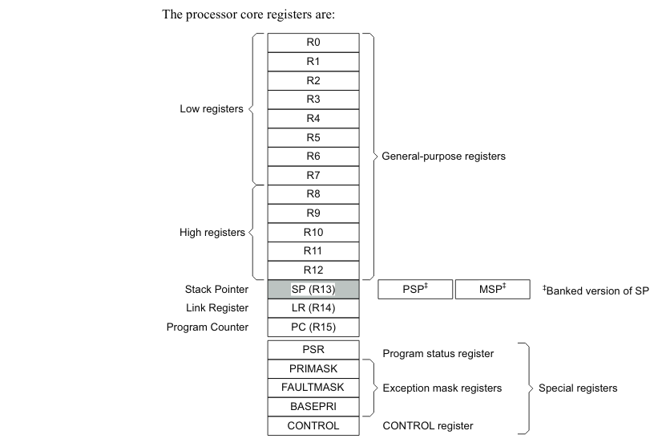

### Key features
* 32-bit CPU
* ARMv7-M architecture
* Single-precision floating-point computations
* SIMD capabilities
* Thumb-2, ensuring high code density
* NVIC(nested vectored interrupt controller) including NMI(non maskable interrupt)
with up to 256 interrupt priority levels.
* 24-bit down-count system timer *SysTick*.
* MPU(memory protection unit)
* 32-bit registers size

### Core registers

---

> All images are taken from [NordicSemiconductors](https://infocenter.nordicsemi.com) site.
> Any copyright belongs to NordicSemiconductors©
