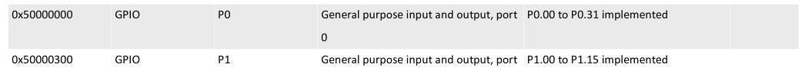

### GPIO
To toggle LED on/off firstly we need to configure corresponding GPIO as output.
It is done by writing logical one to `A` field into corresponding
`PIN_CFN[n]` register. To drive pin high or low `OUTSET` or `OUTCLR` registers
are used. nRF52840 has two GPIO ports `P0` and `P1` with corresponding
base addresses `0x5000000` and `0x50000300` respectively. Register `PIN_CFN[n]`
offset could be derived as `0x700 + (n x 0x4 )`. Registers `OUTSET` and `OUTCLR`
offsets are `0x508` and `0x50C` respectively.

