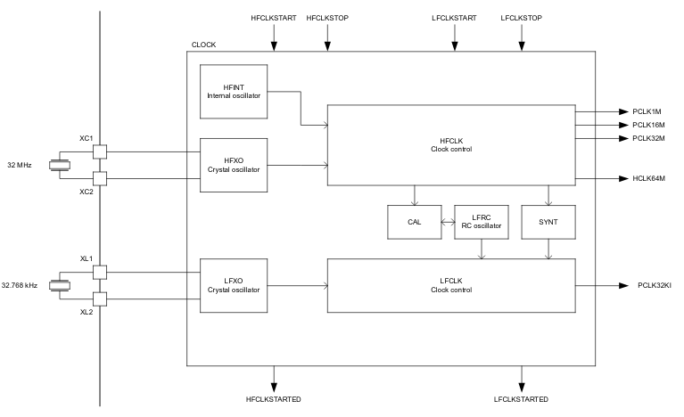

###
nRF52840 has two clocks:
* high frequency (HF) 64 MHz clock
* low frequency (LF) 32.768 kHz clock

These clocks could be generated in different ways. \
HF clock could be generated using:
* on-chip oscilator
* external 32 MHz crystal.

However LF clock could be generated using:
* on-chip +/- 500ppm RC oscillator
* external 32.768 kHz crystal
* synthesized from 64 MHz oscillator

Clock control unit showed below:

---

> Image is taken from [NordicSemiconductor](https://infocenter.nordicsemi.com) site.
> Any copyright belongs to NordicSemiconductors©

The **HFINT** soucre will be used when **HFCLK** is requested and **HFXO** has
not been started. \
The **HFXO** is started by triggering the **HFCLKSTART** task and stopped by
triggering the **HFCLKSTOP** task. When the **HFCLKSTART** is triggered, the
**HFCLKSTARTED** event is generated once the **HFXO** startup time has elapsed.
The **HFXO** startup time is given as the sum of the following:
* **HFXO** power-up time
* **HFXO** debounce time

The **HFXO** must be running to use the **RADIO** or the calibration mechanism
associated with the 32.768 kHz RC oscillator.
