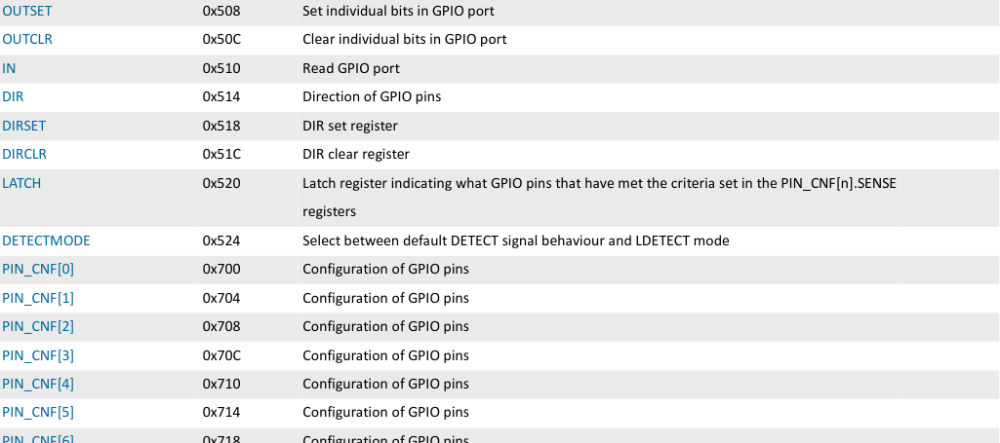
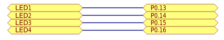
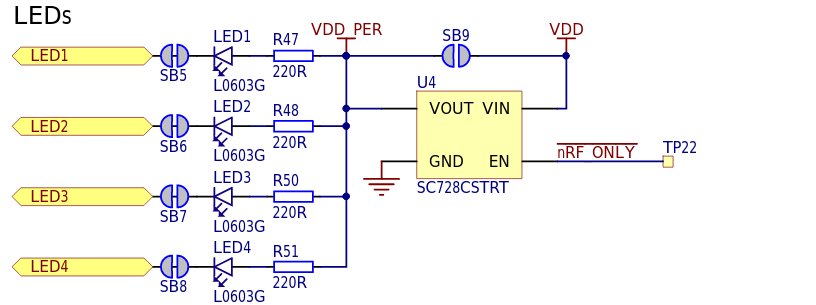

### GPIO
To toggle LED on/off firstly we need to configure corresponding GPIO as output.
It is done by writing logical one to `A` field into corresponding
`PIN_CFN[n]` register. To drive pin high or low `OUTSET` or `OUTCLR` registers
are used. nRF52840 has two GPIO ports `P0` and `P1` with corresponding
base addresses `0x5000000` and `0x50000300` respectively. Register `PIN_CFN[n]`
offset could be derived as `0x700 + (n x 0x4 )`. Registers `OUTSET` and `OUTCLR`
offsets are `0x508` and `0x50C` respectively.




Searching in DK hardware schematics file we can see that leds are connected to
`P0.[13-16]` pins.


Also it could be seen that leds are active low, meaning that when GPIO output
is low then led is turned ON. This is so called sink mode. In source mode action
is opposite.


GPIO is defined as memory mapped IO structure:

```c
typedef volatile struct __attribute__((packed)) {
    uint32_t reserved0[321];    /* 0x000 - 0x500 reserved */
    uint32_t OUT;               /* 0x504 Write GPIO port */
    uint32_t OUTSET;            /* 0x508 Set individual bits in GPIO port */
    uint32_t OUTCLR;            /* 0x50C Clear individual bit in GPIO port */
    uint32_t IN;                /* 0x510 Read GPIO port */
    uint32_t DIR;               /* 0x514 Direction of GPIO port */
    uint32_t DIRSET;            /* 0x518 DIR set register */
    uint32_t DIRCLR;            /* 0x51C DIR clear register */
    uint32_t LATCH;             /* 0x520 Latch register */
    uint32_t DETECTMODE;        /* 0x524 Mode select */
    uint32_t reserved1[118];    /* 0x528 - 0x6FC reserved */
    uint32_t PIN_CNF[32];       /* 0x700 - 0x77C Configuration of GPIO pins*/
} GPIO_Registers;

static GPIO_Registers* gpio[2] = {
    (GPIO_Registers* ) GPIO_0_BASE_ADDRESS,
    (GPIO_Registers* ) GPIO_1_BASE_ADDRESS
};
```

GPIO is encapsulated and interaction is done only throught routines given in
`gpio.h` header file:
```c
void GPIO_setDirection(GPIO_Port port, GPIO_Pin pin, GPIO_Direction direction);
void GPIO_setOutput(GPIO_Port port, GPIO_Pin pin, GPIO_Output output);
GPIO_Output GPIO_getInput(GPIO_Port port, GPIO_Pin pin);
GPIO_Output GPIO_getDriver(GPIO_Port port, GPIO_Pin pin);
```
