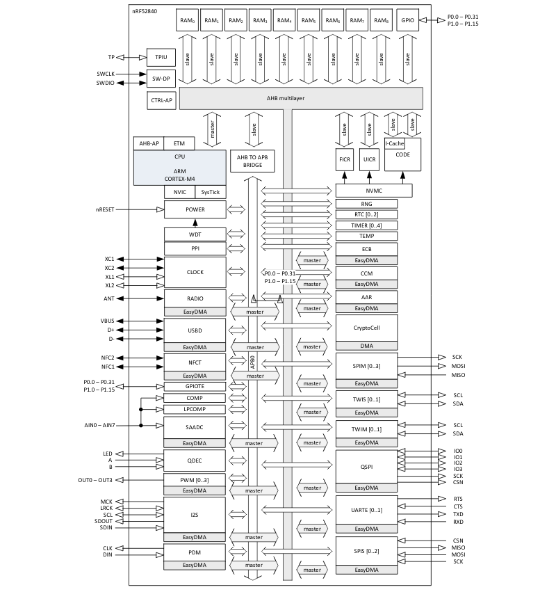

### Summary
* Bluetooth® 5, IEEE 802.15.4-2006, 2.4GHz transceiver
* Sensitivity: -95 dBm @ 1Mbps, -103 dBm @ 125kbps
* TX power: -20 to +8 dBm, with 4 dBm step
* 4.8 mA peak current in TX(0 dBm)
* 4.6 mA peak current in RX
* RSSI(1 dBm resolution)
* Single ended antenna output(on chip balun)
* 128-bit AES/ECB/CCM/AAR co-processor(on the fly packet encryption)
* ARM® Cortex®-M4 32-bit processor with FPU, 64 MHz
* 1 MB flash and 256 kB RAM
* Rich set of security features
* USB 2.0 full speed controller
* QSPI 32 MHz interface
* NFC-A
* Programmable peripheral interconnect
* 48 GPIOs
* EasyDMA
* 12-bit, 200ksps ADC
* 64 level comparator
* Temperature sensor
* 4x 4-channel PWM
* 5x 32-bit timers

### nRF52840 block diagram

---

> All images are taken from [NordicSemiconductors](https://infocenter.nordicsemi.com) site.
> Any copyright belongs to NordicSemiconductors©
