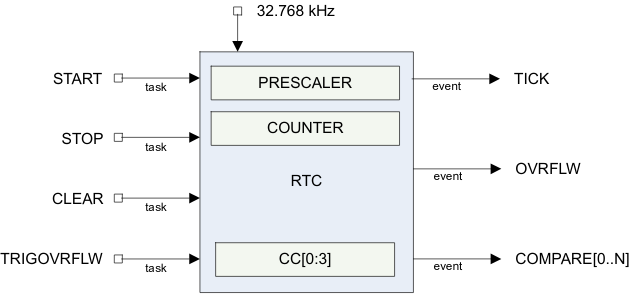

### Real time counter RTC
The Real-time counte (RTC) module provides a generic, low power timer on the
low-frequency clock source(LFCLK). The RTC module features a 24-bit `COUNTER`,
a 12-bit(1/X) prescaler, capture/compare registers, and a tick event generator
for low power, tickless RTOS implementation.

RTC block schematic:



The RTC will run off the LFCLK. The `COUNTER` resolution therefore will be
30.517 us. The software has to explicitely start LFCLK before using RTC.
Counter increment frequency is:
```
f_RTC [kHz] = 32.768 / ( PRESCALER + 1 )
```
Examples:
```
1.  Desired COUNTER frequency 100 Hz
    PRESCALER = round( 32.768 kHz / 100 Hz ) - 1 = 327
    f_RTC = 99.9 Hz
    10009.576 us counter period

2.  Desired COUNTER frequency 8 Hz
    PRESCALER = round( 32.768 kHz / 8 Hz ) - 1 = 4095
    f_RTC = 8 Hz
    125 ms counter period
```
| Prescaler | Counter resolution| Overflow       |
|:---------:|:-----------------:| -------------- |
| 0         | 30.517 us         | 512 seconds    |
| 2^8 - 1   | 7812.5 us         | 131072 seconds |
| 2^12 - 1  | 125 ms            | 582.542 hours  |

###### Overflow features
The `TRIGOVRFLW` task set the `COUNTER` calue to `0xFFFFF0` to allow software
test the overflow condition. Overflow occurs when `COUNTER` overflows from
`0xFFFFFF` to `0`. The `OVRFLW` event is disabled by default.

###### TICK event
The `TICK` event enables low poewr "tick-less" RTOS implementation as it
optionally privides a regular interrupt source for a RTOS without the need
to use ARM SysTick feature.
Using the RTC `TICK` event rather than the SysTick allows the CPU to be powered
down while still keeping RTOS sheduling active. The `TICK` event is disabled
by default.

###### Event control feature
To optimize RTC power consumption, events in RTC can be individually disabled
to prevent PCLK16M and HFCLK being requested when those events are triggered.
This is managed using the `EVTEN` register. \
For example, if the TICK event is not required for an application, this event
should be disabled as it is frequently occuring and may increase power
consumption if HFCLK otherwise could be powered down for long durations.

###### TASK and EVENT jitter/delay
Jitter or delay in the RTC is due to the peripheral clock being a low frequency
clock (LFCLK) which is not synchronous to the faster PCLK16M. \
The following is a summary of jitter introduced on tasks and events.

| Task                           | Delay        |
|:-------------------------------|:-----------: |
| CLEAR, STOP, START, TRIGOVRFLW | +15 to 46 us |

| Operation/Function             | Jitter       |
|:-------------------------------|:-----------: |
| START to COUNTER increment     | +/- 15 us    |
| COMPARE to COMPARE             | +/- 62.5 us  |

#### Registers
| Base address | Peripheral | Instance | Description | Configuration |
|:-------------|:-----------|:---------|:------------|:--------------|
|0x4000B000|RTC|RTC0|Real-time counter 0|CC[0..2] implemented, CC[3] not|
|0x40011000|RTC|RTC1|Real-time counter 1|CC[0..3] implemented|
|0x40024000|RTC|RTC2|Real-time counter 2|CC[0..3] implemented|

```c
typedef volatile struct __attribute__ ((packed)) {
    uint32_t TASKS_START;       // 0x000 Start RTC counter
    uint32_t TASKS_STOP;        // 0x004 Stop RTC counter
    uint32_t TASKS_CLEAR;       // 0x008 Clear RTC counter
    uint32_t TASKS_TRIGOVRFLW;  // 0x00C Set counter to 0xFFFFF0
    uint32_t reserved0[60];     // 0x010 - 0x0FC reserved
    uint32_t EVENTS_TICK;       // 0x100 Event on COUNTER increment
    uint32_t EVENTS_OVRFLW;     // 0x104 Event on COUNTER overflow
    uint32_t reserved1[14];     // 0x108 - 0x13C reserved
    uint32_t EVENTS_COMPARE[4]; // 0x140 - 0x14C Compare event on CC[n] match
    uint32_t reserved2[109];    // 0x150 - 0x300 reserved
    uint32_t INTENSET;          // 0x304 Enable interrupt
    uint32_t INTENCLR;          // 0x308 Disable interrupt
    uint32_t reserved3[13];     // 0x30C - 0x33C reserved
    uint32_t EVTEN;             // 0x340 Enable or disable event routing
    uint32_t EVTENSET;          // 0x344 Enable event routing
    uint32_t EVTENCLR;          // 0x348 Disable event routing
    uint32_t reserved4[110];    // 0x34C - 0x500 reserved
    uint32_t COUNTER;           // 0x504 Current COUNTER value
    uint32_t PRESCALER;         // 0x508 12-bit prescaler for COUNTER frequency
    uint32_t reserved5[13];     // 0x50C - 0x53C reserved
    uint32_t CC[4];             // 0x540 - 0x54C Compare register
} RtcRegisters;

static RtcRegisters* rtc[3] = {
    (RtcRegisters* )0x4000B000u,
    (RtcRegisters* )0x40011000u,
    (RtcRegisters* )0x40024000u
};
```

Control over RTC is given by routines declared in `rtc.h` file:
```c
typedef enum { RTC_0 = 0, RTC_1, RTC_2 } RtcModule;

void startCounterRtc(RtcModule rtcModule);
void stopCounterRtc(RtcModule rtcModule);
void clearCounterRtc(RtcModule rtcModule);
void setTrigOvrFlw(RtcModule rtcModule);
// TODO add remaining ones
```
