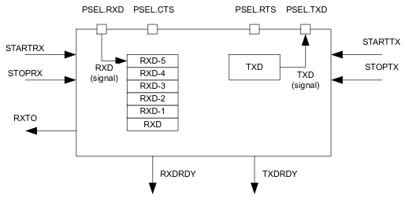

### UART

nRF52840 has 2x UART on chip including one with DMA support. At the moment only
UART **without** DMA will be used. UART module implements the following:
* full-duplex operation
* automatic flow control
* parity checking and generation for 9th data bit
* up to 1Mega baud rate

###### Pin configuration
The different signals `RXD`, `CTS`(Clear To Send, active low), `RTC`(Request
To Send,active low), and `TXD` associated with the UART are mapped to physical
pins according to the configuration specified in the `PSEL.RXD`, `PSEL.CTS`,
`PSEL.RTS` and `PSEL.TXD` registers respectively.

If the `CONNECT` field of a `PSEL.xxx` register is set to `Disconnected`, the
associated UART signal will not be connected to any physical pin. The
`PSEL.RXD`,`PSEL.CTS`, `PSEL.RTS` and `PSEL.TXD` registers and their
configurations are only used as long as the UART is enabled, and retained only
for the duration the device is in `ON` mode. `PSEL.RXD`, `PSEL.CTS`,
`PSEL.RTS` and `PSEL.TXD` must only be configured when the UART is disabled.

| UART pin | Direction | Output value   |
|:-------- |:--------- |:-------------- |
| RXD      | Input     | Not applicable |
| CTS      | Input     | Not applicable |
| RTS      | Output    | 1              |
| TXD      | Output    | 1              |

###### Shared resources
The UART shares registers and other resources with other peripherals that have
the same ID as the UART. Therefore, you must disable all peripherals that have
the same ID as UART before the UART can be configured and used.

###### Transmission
A UART transmission sequence is started by triggering the `STARTTX` task.

Bytes are thansmitted by writing to the `TXD` register. When a byte has been
succesfully thansmitted the UART will generate `TXDRDY` event after which a new
byte can be written to the `TXD` register. A UART transmission sequence is
stopped immediately bu triggering the `STOPTX` task.

If flow control is enabled a transmission will be automatically suspended when
`CTS` is deactivated and resumed when `CTS` is activated again. A byte that is
in transmission when `CTS` is deactivated will be fully transmitted before the
transmission is suspended.

###### Reception
A UART reception sequence is started by triggering the `STARTRX` task.

The UART receiver chain implements FIFO capable of storing six incoming `RXD`
bytes before data is overwritten. Bytes are extracted from this FIFO by reading
the `RXD` register. When a byte is extracted from the FIFO a new byte pending
in the FIFO will be moved to the `RXD` register. The UART will generate an
`RXDRDY` event every time a new byte is moved to the `RXD` register.

When flow control is enabled, the UART will deactivate the `RTS` signal when
there is only space for four more bytes in the receiver FIFO. The counterpart
transmitter is therefore able to send up to four bytes after the `RTS` signal
is deactivated before data is being overwritten. To prevent overwriting data
in the FIFO, the counterpart UART transmitter must therefore make sure to stop
transmitting data within four bytes after the `RTS` line is deactivated. The
`RTS` signal will first be activated again when the FIFO has been emptied,
that is, when all bytes in the FIFO have been read by the CPU.

The `RTS` signal will also be deactivated when the receiver is stopped throught
`STOPRX` task. The UART is able to receive four to five additional bytes is
they are sent in succession immediately after the `RTS` signal has been
deactivated. This is possible because the UART is, even after the `STOPRX` task
is triggered, able to receive bytes for an extended period of time dependent on
the configured baud rate. The UART will generate a receiver timeout event
(`RXTO`) when this period has elapsed.

To prevent loss of incoming data the `RXD` register must only be read one time
following every `RXDRDY` event.

To secure that the CPU can detect all incoming `RXDRDY` events throught
`RXDRDY` event register, the `RXDRDY` event register must be cleared before the
`RXD` register is read. The reason for this is that the UART is allowed to
write a new byte to the `RXD` register, and therefore can also generate a new
event, immediatelly after the `RXD` register is read (emptied) by the CPU.

###### Suspending the UART
The UART can be suspended by triggering the `SUSPEND` task.

`SUSPEND` will affect both the UART receiver and the UART transmitter, i.e. the
transmitter will stop transmitting and the receiver will stop receiving. UART
transmission and reception can be resumed, after being suspended, by triggering
`STARTTX` and `STARTRX` respectively.

Following a `SUSPEND` task, an ongoing `TXD` byte transmission will be
completed before the UART is suspended.

When the `SUSPEND` task is triggered, the UART receiver will behave in the
same way as it does when the `STOPRX` task is triggered.

###### Error conditions
An `ERROR` event, in the form of a framing error, will be generated if a valid
stop bit is not detected in a frame. Another `ERROR` event, in the form of a
break condition, will be generated if the `RXD` line is held active low for
longer than the length of a data frame. Effectively, a framing error is always
generated before a break condition occurs.

> TODO complete description
